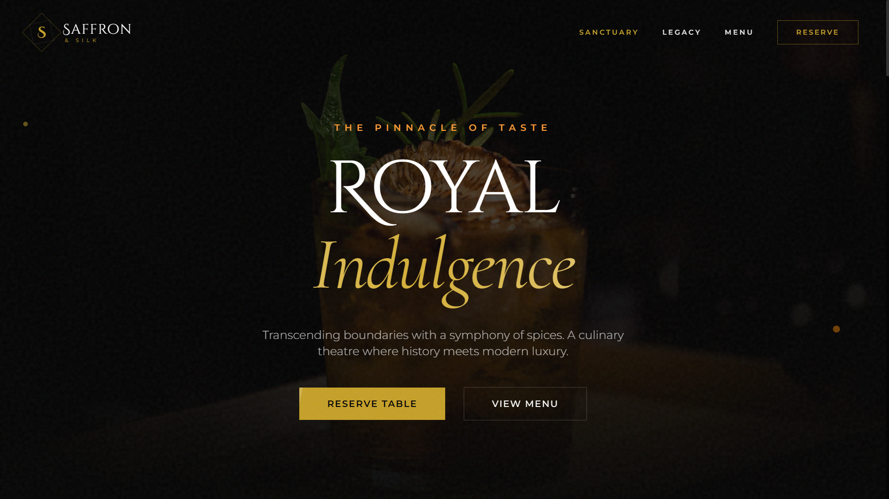

<div align="center">

# ✨ Saffron & Silk

### 🍽️ Luxury Indian Fine Dining Experience

*A premium, vegetarian-focused restaurant website with stunning dark aesthetics and gold accents*

[](https://saffron-silk-by-harsh.vercel.app)
[](https://github.com/panduthegang/Saffron-Silk-Saas)
[](LICENSE)

</div>

---

<div align="center">
  
</div>

---

## 🎯 Overview

**Saffron & Silk** is a luxurious, Michelin-star inspired restaurant website showcasing the pinnacle of vegetarian Indian cuisine. Built with modern web technologies, it features smooth animations, elegant typography, and a premium dark-mode aesthetic with gold accents.

---

## 🛠️ Tech Stack

<div align="center">

| Technology | Description |
|:---:|:---|
|  | Frontend UI Library |
|  | Type-Safe JavaScript |
|  | Next-Gen Build Tool |
|  | Utility-First CSS |
|  | Client-Side Routing |

</div>

---

## ✨ Features

<table>
<tr>
<td width="50%">

### 🎨 Design & UI
- 🌙 **Dark Mode Aesthetic** - Elegant midnight theme
- ✨ **Gold Accents** - Premium color palette
- 🖋️ **Decorative Typography** - Cinzel & Cormorant fonts
- 📱 **Fully Responsive** - Mobile-first design
- 🎭 **Smooth Animations** - Fade-in, parallax effects

</td>
<td width="50%">

### 🚀 Functionality
- 🧭 **Multi-Page Navigation** - React Router integration
- 📜 **Interactive Menu** - Category-based filtering
- 👨‍🍳 **Chef Showcase** - Team profiles with hover effects
- 💬 **Testimonials** - Customer reviews section
- 📅 **Reservations** - Multi-step booking flow
- 📍 **Contact & Hours** - Restaurant information

</td>
</tr>
</table>

---

## 📂 Project Structure

```
📁 Saffron-Silk-Saas/
├── 📁 public/
│   ├── 🖼️ Thumbnail.png          # Social media preview image
│   └── 🎨 logo.svg                # Brand logo (SVG)
│
├── 📁 src/
│   ├── 📁 components/
│   │   ├── 📄 Navbar.tsx          # Navigation with mobile menu
│   │   ├── 📄 Footer.tsx          # Site footer with links
│   │   └── 📄 SectionTitle.tsx    # Reusable section headers
│   │
│   ├── 📁 pages/
│   │   ├── 📄 LandingPage.tsx     # Homepage with hero, stats, features
│   │   ├── 📄 AboutPage.tsx       # Chef profiles & restaurant story
│   │   ├── 📄 MenuPage.tsx        # Full vegetarian menu
│   │   └── 📄 ReservationPage.tsx # Multi-step booking form
│   │
│   ├── 📄 App.tsx                 # Root component with routing
│   ├── 📄 main.tsx                # React entry point
│   └── 🎨 index.css               # Global styles & Tailwind
│
├── 📄 index.html                  # HTML template with meta tags
├── 📄 package.json                # Dependencies & scripts
├── 📄 tailwind.config.js          # Tailwind customization
├── 📄 vite.config.ts              # Vite configuration
├── 📄 tsconfig.json               # TypeScript config
└── 📄 README.md                   # You are here! 👋
```

---

## 🚀 Getting Started

### Prerequisites

- **Node.js** (v18 or higher)
- **npm** or **yarn**

### Installation

1️⃣ **Clone the repository**
```bash
git clone https://github.com/panduthegang/Saffron-Silk-Saas.git
cd Saffron-Silk-Saas
```

2️⃣ **Install dependencies**
```bash
npm install
```

3️⃣ **Start development server**
```bash
npm run dev
```

4️⃣ **Open in browser**
```
http://localhost:5173
```

---

## 📜 Available Scripts

| Command | Description |
|---------|-------------|
| `npm run dev` | Start development server with hot reload |
| `npm run build` | Build for production |
| `npm run preview` | Preview production build locally |
| `npm run lint` | Run ESLint for code quality |

---

## 🎨 Design System

### Color Palette

| Color | Hex | Usage |
|-------|-----|-------|
| 🟡 **Gold** | `#D4AF37` | Primary accent, highlights |
| 🟠 **Saffron** | `#FF9933` | Secondary accent |
| ⬛ **Midnight** | `#050505` | Background |
| ◼️ **Charcoal** | `#0F0F0F` | Cards, sections |
| 🟢 **Emerald** | `#022C22` | Subtle accents |

### Typography

- **Decorative**: Cinzel Decorative (Headings)
- **Serif**: Cormorant Garamond (Body text)
- **Sans**: Montserrat (UI elements)

---

## 📱 Pages

| Page | Route | Description |
|------|-------|-------------|
| 🏠 **Home** | `/` | Hero, signature dishes, features, testimonials |
| 📖 **About** | `/about` | Restaurant story, philosophy, chef profiles |
| 🍽️ **Menu** | `/menu` | Full vegetarian menu with tasting experience |
| 📅 **Reserve** | `/reserve` | Multi-step table reservation & dining policies |

---

## 🤝 Contributing

Contributions are welcome! Feel free to:

1. Fork the repository
2. Create a feature branch (`git checkout -b feature/amazing-feature`)
3. Commit changes (`git commit -m 'Add amazing feature'`)
4. Push to branch (`git push origin feature/amazing-feature`)
5. Open a Pull Request

---

## 📄 License

This project is licensed under the **MIT License** - see the [LICENSE](LICENSE) file for details.

---

## 👨‍💻 Author

<div align="center">

**Made with ❤️ by [panduthegang](https://github.com/panduthegang)**

[](https://github.com/panduthegang)

</div>

---

<div align="center">

### ⭐ Star this repo if you found it useful!

</div>
